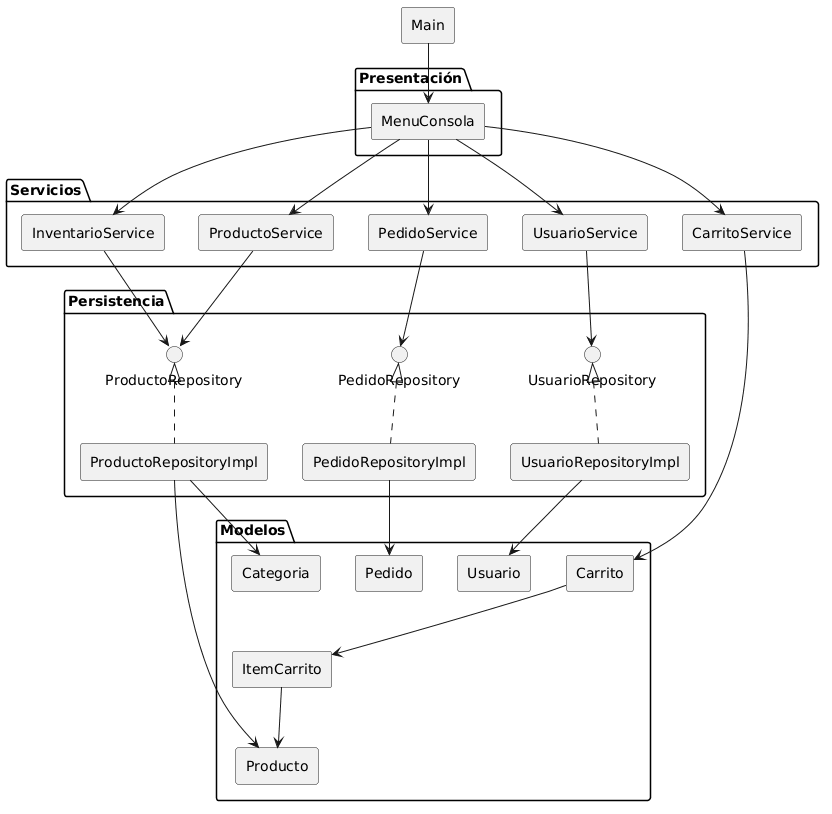
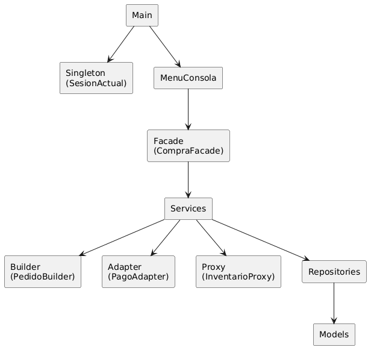

# Funcionamiento General
Dado que algunas personas con pauperrima interaccion neuronal (Fernando) no creo que hayan entendido como funciona el proycto, se lo voy a explicar.

# Flujo de llamadas:

A grandes rasgos, el flujo del sistema se ve así:

Al menos de lo que yo tengo hecho.

# Representaciones y consideraciones
## Presentación (presentation)
Es la chamba de Enzo y aquí tiene que dividir todo el menu de la consola, puede hacerlo todo en un archivo o dividirlo en clases, desde aquí se llaman a los services.

## Servicios (service)
Los services o servicios contienen toda la logica de negocio, se hacen calculos, confirmaciones y procesos netos del negocio, como registrar productos, registrar usuarios, eliminar productos, buscar productos, listar productos. (no confundir el listar productos con el listar arrayList que veremos más adelante)

## Persistencia (repository)
Esta es nuestra "base de datos" pero con arrayList, como puedes ver en el flujo existen dos tipos: repository y repositoryImpl.

- repository: Estas son interfaces, siempre son interfaces y declaran las funciones necesarias para el arrayList como agregar, eliminar, listar.
> En el service también hay un agregar y eliminar, pero a diferencia de este el agregar es literalmente arrayList.add(CosaAgregar), mientras que el service tiene que hacer validaciones como verficiar si el producto esta registrado y despues llama a la funciona agregar del repository para agregarlo, son funciones separadas pero que se utilizan desde el service.
- repository.impl: Aca se crean las clases que implementan la interfaz que se necesite y se instancia el arrayList como atributo, se sobreescriben las funciones de la interfaz para darles funcionalidad a su antojo. (Si tienes ProductoRepository, su implementacion es: ProductoRepositoryImpl).
> Recomiendo que vean lo que hice para que se hagan una idea.

## Modelos (model)
Aquí estan los objetos de negocio, estas clases solamente tienen sus atributos, sus Getters y Setters y su(s) constructor(es), no tienen funciones lógicas u operativas
> [!IMPORTANT] Si para tu flujo de trabajo necesitas un atributo que no está puedes agregarlo, intenta que, en la medida de lo posible, solo agregues cosas a los models, no las quites o las modifiques, ya que así el merge es más sencillo y, de modificar o agregar atributos puedes malograr otro flujo de trabajo que dependen de esos atributos

# ¿Y qué hay de los patrones?

Los patrones (singleton, proxy, prototype, etc) no tienen un sitio propio y estático en el flujo, se implementan donde sean necesario, normalmente entre capas, de la siguiente manera:

Este es un ejemplo de cómo podrían implementarse los patrones, cada patrón tiene su propósito y su posición en el flujo del sistema es más situacional que predeterminada.